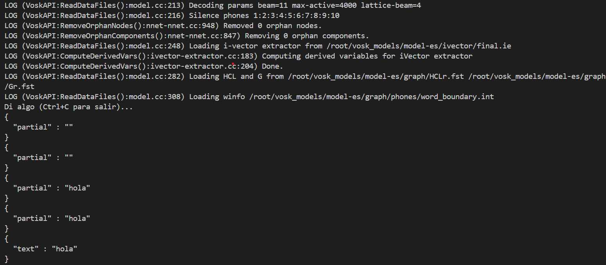

# Tutorial to Create a Virtual Test Environment in Debian for Using Vosk

This is a step-by-step tutorial to create a virtual environment in Python and develop our first voice recognition scripts with Vosk.

## Step 1: Install the necessary package to create the Python virtual environment

```bash
apt install python3-venv -y
```

## Step 2: Create a virtual environment in your home directory

```bash
python3 -m venv ~/vosk_env
```

## Step 3: Activate the virtual environment

```bash
source ~/vosk_env/bin/activate
```

## Step 4: Install Vosk and the necessary libraries inside the virtual environment

```bash
pip install vosk numpy
```

## Step 5: Download a voice model

```bash
mkdir -p ~/vosk_models && cd ~/vosk_models

wget https://alphacephei.com/vosk/models/vosk-model-small-en-us-0.15.zip

unzip vosk-model-small-en-us-0.15.zip

mv vosk-model-small-en-us-0.15 model-en
```

## Step 7: Install PortAudio on Debian

PortAudio is a library that handles audio in **sounddevice**.

Exit the virtual environment:

```bash
deactivate
```

Install PortAudio in the operating system:

```bash
sudo apt install portaudio19-dev -y
```

## Step 8: Install Sounddevice in the virtual environment

Activate the virtual environment:

```bash
source ~/vosk_env/bin/activate
```

Install **Sounddevice**:

```bash
pip install sounddevice
```

Verify the sounddevice installation:

```bash
python3 -c "import sounddevice as sd; print(sd.query_devices())"
```

If it displays a list of audio devices, it means that PortAudio is already working.

## Step 6: Create a script to test voice recognition

Download the file [test_vosk.py](https://github.com/verybboy/EcoEco-Accessible-OS/blob/main/virtual-environment-vosk/tutorial-EN/scripts/test_vosk.py)

Run the script:

```bash
python3 ~/test_vosk.py
```

## Example Output


