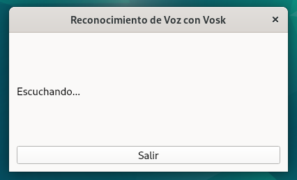

# Create a Graphical Application That Provides Feedback to the User When Using Voice Recognition to Create a Folder

If you want to learn how to use Vosk to create graphical applications that allow you to perform more actions, besides creating a folder by voice, check out the following file: [005-more-actions-app.md](https://github.com/verybboy/EcoEco-Accessible-OS/blob/main/virtual-environment-vosk/tutorial-EN/005-more-actions-app.md)

## STEP 1: Install the Necessary Dependencies on Debian

Run the following command in your terminal to install the required libraries on Debian:

```bash
sudo apt update && sudo apt install -y libxcb-cursor0 libxkbcommon-x11-0
```

## STEP 2: Install the Necessary Dependencies in the Virtual Environment

Activate the virtual environment:

```bash
source ~/vosk_env/bin/activate
```

Install PyQt6:

```bash
pip install PyQt6
```

## STEP 3: Download the Script That Runs the Application and Allows Creating a Folder by Voice

Download the file [voice_folder_creator_app.py](https://github.com/verybboy/EcoEco-Accessible-OS/blob/main/virtual-environment-vosk/tutorial-EN/scripts/voice_folder_creator_app.py)

Run the application:

```bash
python voice_folder_creator_app.py
```

## Example Output


